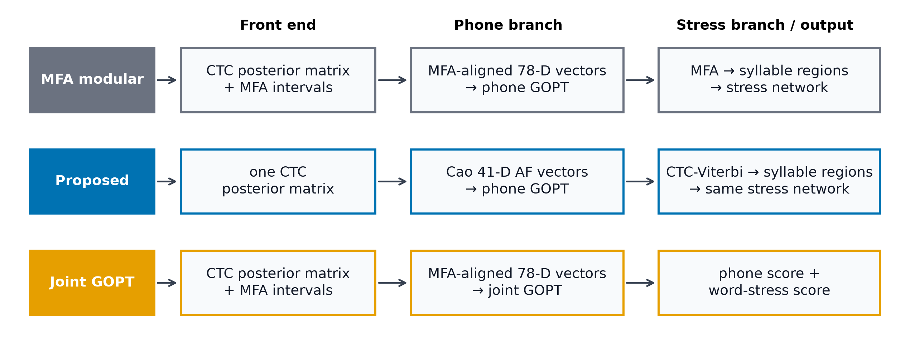
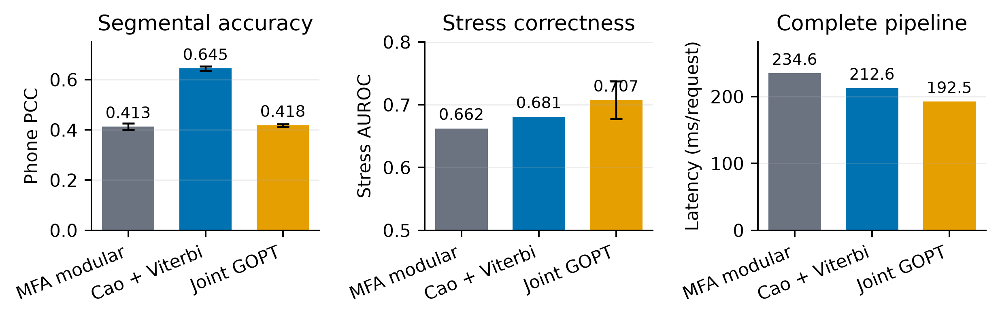

<div align="center">

<h1>Alignment Only Where Needed</h1>
<h3>Alignment-free phoneme scoring + embedded CTC-Viterbi stress assessment</h3>

<p>
  <a href="output/pdf/alignment_only_where_needed.pdf"></a>
  <a href="paper/results/three_system_comparison.json"></a>
  <a href="paper/results/three_system_latency.json"></a>
  <a href="tests"></a>
</p>

<p><strong>Phone scores do not need boundaries. Stress features do.</strong><br>
This project aligns only the branch that actually needs temporal regions.</p>

</div>



## The idea

One resident CTC model produces a posterior matrix. The proposed system reuses
it in two different ways:

```text
audio + canonical phones
          │
          ▼
  CTC posterior matrix
          ├── Cao 41-D alignment-free vectors ──► phone-only GOPT ──► phone score
          │
          └── transcript-conditioned Viterbi ──► syllable features
                                                   └──► LSTM/attention ──► stress
```

- **Phoneme score:** [Cao et al.'s alignment-free CTC vector](https://doi.org/10.21437/Interspeech.2024-459) + phone-only GOPT.
- **Syllable stress:** a [Mallela-inspired sequential network](https://doi.org/10.21437/Interspeech.2024-2404) using embedded CTC-Viterbi intervals.
- **No peak alignment. No request-time MFA/Kaldi job in the proposed system.**

The Viterbi path is conditioned on the known phone transcript. It is embedded
localization—not unconstrained phone recognition.

## Results at a glance

The experiment uses the official speaker-disjoint SpeechOcean762 split. Phone
metrics share the same **46,119 held-out phones** across all systems. Stress
metrics share **2,354 polysyllabic words**, including 72 expert-rated errors.
Learned GOPT results are mean ± sample standard deviation over five independent
seeds.

| | MFA modular | **Proposed** | Joint GOPT |
|---|---:|---:|---:|
| **Phone PCC ↑** | 0.413 ± 0.013 | **0.645 ± 0.009** | 0.418 ± 0.005 |
| **Phone SRCC ↑** | 0.381 ± 0.004 | **0.432 ± 0.003** | 0.378 ± 0.003 |
| **Phone MSE ↓** | 0.112 ± 0.002 | **0.079 ± 0.002** | 0.111 ± 0.001 |
| **Stress AUROC ↑** | 0.662 | 0.681 | **0.707 ± 0.030** |
| **Stress PCC ↑** | 0.077 | 0.100 | **0.189 ± 0.017** |
| **Stress location¹ ↑** | **85.85%** | 85.14% | not produced |
| **Complete CPU latency ↓** | 234.6 ms | 212.6 ms | **192.5 ms** |

¹ Canonical-location accuracy among 2,282 words rated stress-correct by the experts.



### What the numbers say

- The proposed phone PCC improves by **+0.232 ± 0.019** over the modular MFA
  baseline across matched seeds.
- The complete proposal is **1.10× faster** than modular MFA: 212.6 versus
  234.6 ms/request.
- Viterbi and MFA stress localization are statistically unresolved. The
  Viterbi-minus-MFA location difference is −0.70 percentage points, with a 95%
  paired speaker-bootstrap CI of [−1.81, +0.48].
- Joint GOPT is fastest because one joint head replaces the separate TensorFlow
  stress network. It has stronger scalar stress results here, but substantially
  weaker phone correlation and no stress-location output.

> **Defensible conclusion:** Cao alignment-free features substantially improve
> phone scoring, while embedded CTC-Viterbi removes the external aligner from
> the stress branch without a statistically resolved stress-accuracy change.

This is not a formal non-inferiority result: no stress margin was
preregistered, and only 72 common polysyllabic words have an error label.

## The three complete systems

| System | Phone branch | Stress branch | External MFA |
|---|---|---|:---:|
| **MFA modular** | MFA-aligned 78-D CTC vector → phone GOPT | MFA intervals → fixed sequential scorer | Yes |
| **Cao + Viterbi (proposed)** | Cao 41-D alignment-free vector → phone GOPT | CTC-Viterbi intervals → same scorer | **No** |
| **Joint GOPT** | MFA-aligned 78-D vector → multi-task GOPT | GOPT word-stress head | Yes |

The third comparator follows [Gong et al.'s GOPT](https://doi.org/10.1109/ICASSP43922.2022.9746743)
architecture, adapted to the same CTC front end for a controlled comparison.
The unchanged official GOPT checkpoint is validated separately on its released
LibriSpeech tensors:

| Official checkpoint audit | Reproduced | Repository report |
|---|---:|---:|
| Phone PCC | 0.618 | 0.616 |
| Word-stress PCC | 0.325 | 0.326 |

## Explore the research artifacts

| Artifact | What it contains |
|---|---|
| [Scientific paper](output/pdf/alignment_only_where_needed.pdf) | Five-page manuscript with method, protocol, results, and limitations |
| [Result audit](paper/PAPER_SUMMARY.md) | Compact explanation of every reported claim |
| [Accuracy JSON](paper/results/three_system_comparison.json) | Five-seed metrics, counts, bootstrap intervals, and protocol metadata |
| [Latency JSON](paper/results/three_system_latency.json) | Equal-resource stage and complete-pipeline timing |
| [Official GOPT audit](paper/results/gopt_official_validation.json) | Reproduction using the official checkpoint and tensors |
| [Paired stress rows](paper/results/three_system_stress.words.csv) | Word-level MFA and Viterbi outputs for audit |

## Reproduce the experiment

The Cao and GOPT repositories/checkpoints and SpeechOcean762 are external
research assets. Place them under the ignored `tmp/` paths expected by the
benchmark, then run:

```bash
source venv/bin/activate

# 1. Shared CTC emissions, Cao vectors, Viterbi regions, and MFA vectors
python benchmarks/compare_three_systems.py features \
  --feature-batch-size 8 --overwrite

# 2. Paired fixed-network stress evaluation
python benchmarks/compare_three_systems.py stress

# 3. Five independent GOPT training runs
python benchmarks/compare_three_systems.py train \
  --seeds 5 --epochs 100 --batch-size 25

# 4. Equal-resource complete-pipeline latency
python benchmarks/compare_three_systems.py latency \
  --device cpu --latency-samples 100

# 5. Official GOPT checkpoint reproduction and manuscript figures
python benchmarks/compare_three_systems.py validate-gopt
python paper/generate_three_system_figure.py
```

### Verify the implementation

```bash
python -m unittest discover -s tests -v
```

The tests cover exhaustive CTC path sums, Cao feature ordering, repeated-phone
Viterbi separation, substitution-preserving MFA mapping, and GOPT tensor
shapes.

## Run the API

```bash
python3.11 -m venv venv
source venv/bin/activate
pip install -r server/requirements.txt
uvicorn server.main:app --host 127.0.0.1 --port 8000
```

```bash
curl -X POST http://127.0.0.1:8000/assess \
  -F "word=banana" \
  -F "audio=@recording.wav" \
  -F "method=ctc_viterbi"
```

The service exposes the embedded CTC-Viterbi assessment path. The experimental
Cao alignment-free phone scorer and three-system evaluation live in the
benchmark code.

## Project map

```text
benchmarks/
├── compare_three_systems.py    end-to-end experiment and artifact generation
└── three_system_models.py      self-contained phone-only and joint GOPT models

server/
├── services/gop_service.py     resident CTC model and Viterbi decoder
└── services/stress_service.py  sequential syllable-stress inference

paper/
├── main.tex                    manuscript source
├── PAPER_SUMMARY.md            result and claim audit
└── results/                    metrics, paired rows, predictions, checkpoints

tests/
└── test_three_system_comparison.py
```

## Scientific scope

- The stress checkpoint is a local Mallela-inspired architectural adaptation,
  not Mallela et al.'s ISLE checkpoint or an exact corpus reproduction.
- The controlled joint-GOPT row uses 78-D CTC vectors rather than the original
  84-D Kaldi GOP front end.
- The alignment-free phone model sees 1,012 more training phones because it
  does not depend on successful MFA output. This is a real system advantage but
  also limits a feature-only causal interpretation.
- Speed ratios are specific to this ARM64 CPU, one-request execution, four
  shared PyTorch threads, and one MFA job.

For the full methodology and limitations, read the
**[paper](output/pdf/alignment_only_where_needed.pdf)**.
